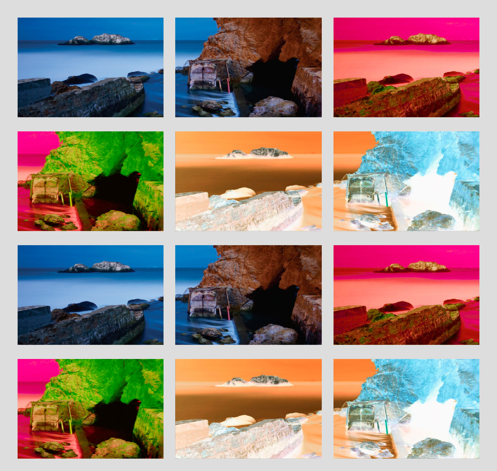
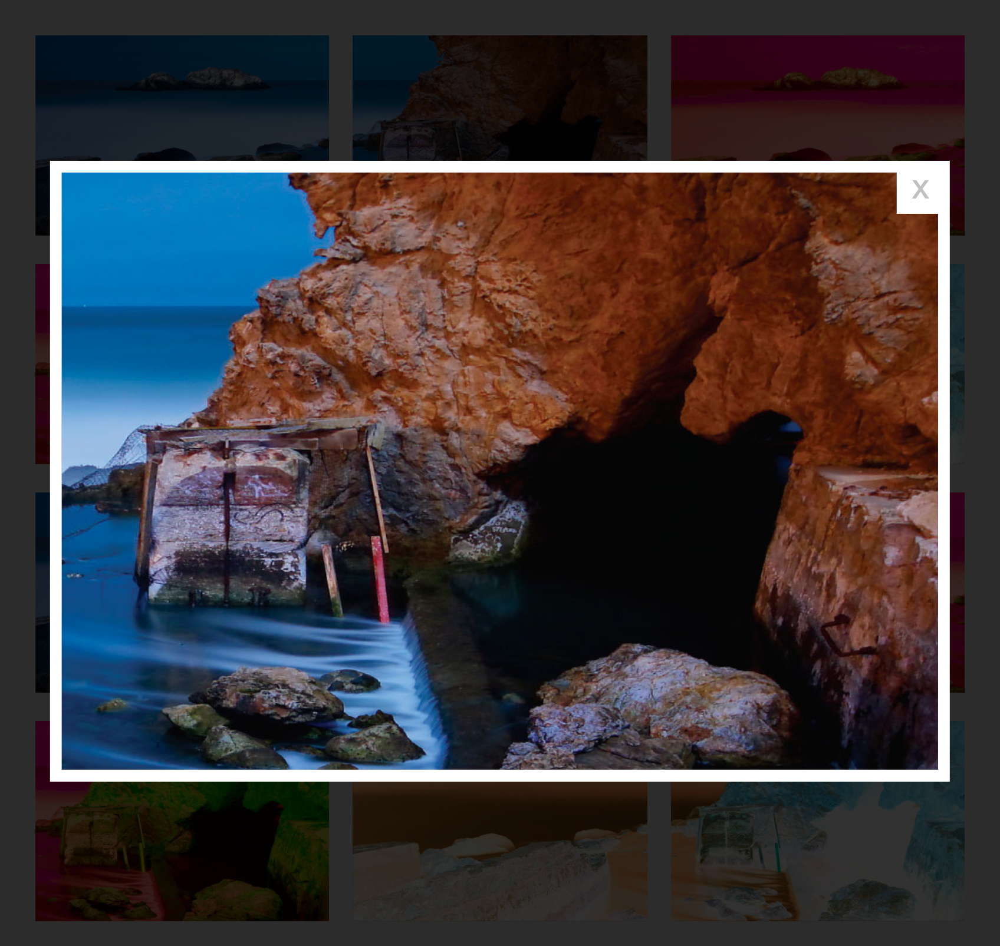

# Photo-Gallery 📸🎞

# Carousel-Slides 💻🎠

Photo gallery made with HTML, CSS and Vanilla Javascript. It has a modal view when clicking on any image of the gallery.

To see how it works click <a href="https://bluedokk.github.io/Photo-Gallery/">[here]</a>.

For better performance use the minified version of the javascript file: <i style="color:#F42;">js/gallery.min.js</i>

In addition, this carrousel use icons from Font Awesome, for this reason, the file <i style="color:#F42;">js/all.min.js</i> is necessary.

## Screenshots

  

  

<i>Developed by: engineer Javier Velasquez. (2021)</i>
